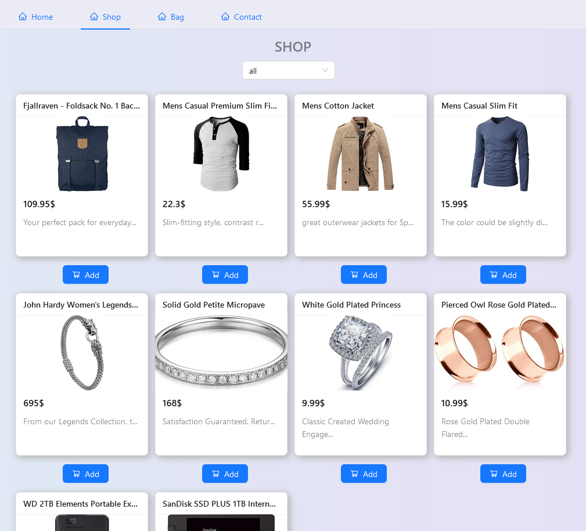
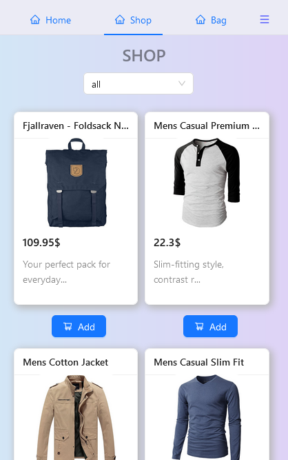

# Shopee 
**Project Description**   
This is my e-commerce project built with [React](https://reactjs.org/), [Ant Design](https://ant.design) and [FakeStore](https://fakestoreapi.com) API
  
>  Preview it [here](https://Annaick.github.io/shop)
  
## Table of contents 
- [Overview](#overview)
    - [Screenshot](#screenshot)
    - [Preview](#preview)
    - [Built with](#built-with)
- [Author](#author)
----  
## Overview  
The application is fully **responsive** and **accessible** thanks to ant Design OOFB Components who made the development process easy and fast
### Screenshot

*Desktop*  

*Mobile* 

### Preview
- Live Site: Click [here](https://Annaick.github.io/shop)  

###  Built with
- [Vite](https://vitejs.dev) as Build tool
- [npm](https://npmjs.com) as package manager
- Framework [React](https://reacjs.org)
- [Ant Design](https://ant.design) UI library
- [Fakestore API](https://fakestoreapi.com)
----
## Author
- LinkendIn: Click [here](https://www.linkedin.com/in/tiana-anna%C3%AFck-b21914285?utm_source=share&utm_campaign=share_via&utm_content=profile&utm_medium=android_app
)
- Email: annaick.tiana@gmail.com
